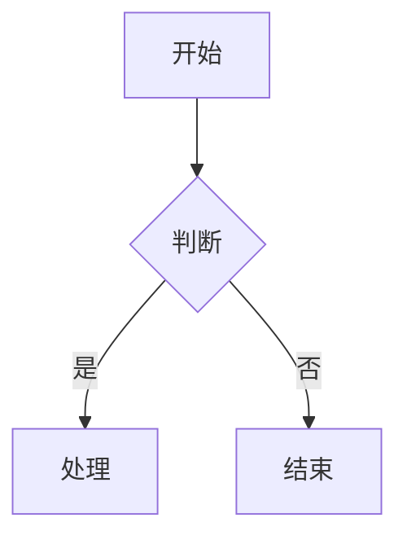

<p align="center">
  
</p>

<h1 align="center">feishu-cli</h1>

<p align="center">
  飞书开放平台命令行工具 — Markdown 与飞书文档双向转换，AI Agent 的飞书操控引擎。
</p>

<p align="center">
  <a href="https://github.com/riba2534/feishu-cli/releases"></a>
  <a href="https://go.dev/"></a>
  <a href="https://github.com/riba2534/feishu-cli/stargazers"></a>
  <a href="https://github.com/riba2534/feishu-cli/blob/main/LICENSE"></a>
</p>

<p align="center">
  <a href="#feishu-cli-是什么">介绍</a> · <a href="#核心能力">核心能力</a> · <a href="#快速开始">快速开始</a> · <a href="#命令参考">命令参考</a> · <a href="#ai-技能集成">AI 技能</a> · <a href="#贡献">贡献</a>
</p>

---

## feishu-cli 是什么

feishu-cli 是一个功能完整的飞书开放平台命令行工具。它将飞书文档、知识库、电子表格、消息、日历、任务等操作封装为简洁的命令行接口，**核心能力是 Markdown ↔ 飞书文档双向无损转换**。

除了传统的 CLI 用法，feishu-cli 还为 [Claude Code](https://claude.ai/claude-code) 等 AI 编程助手提供了 **18 个开箱即用的技能文件**，让 AI Agent 能够直接创建文档、发送消息、管理权限 — 无需任何额外配置。

### 为什么选择 feishu-cli

- **双向转换零损耗** — 支持 40+ 种块类型，Markdown 导入飞书后再导出，内容完整保留
- **图表原生渲染** — Mermaid（8 种图表类型）和 PlantUML 自动转换为飞书画板，不是截图，是可编辑的矢量图
- **大规模文档处理** — 三阶段并发管道架构，实测 10,000+ 行 / 127 个图表 / 170+ 个表格一次导入
- **AI Agent 原生** — 18 个技能文件覆盖飞书全功能，AI 助手即装即用
- **一个工具覆盖全平台** — 文档、知识库、表格、消息、日历、任务、权限、画板、评论、搜索

## 核心能力

### Markdown ↔ 飞书文档

将本地 Markdown 文件一键上传到飞书，或将飞书文档导出为 Markdown。支持完整语法转换：

```bash
# 导入：Markdown → 飞书文档
feishu-cli doc import report.md --title "技术报告" --verbose

# 导出：飞书文档 → Markdown
feishu-cli doc export <document_id> -o doc.md --download-images
```

**支持的语法**：标题（6 级）、段落、列表（无限深度嵌套）、任务列表、代码块、引用、Callout（6 种类型）、表格（自动拆分）、分割线、图片、链接、公式、粗体 / 斜体 / 删除线 / 下划线 / 行内代码 / 高亮

### Mermaid / PlantUML 图表

Markdown 中的 Mermaid 和 PlantUML 代码块**自动转换为飞书画板**（可编辑矢量图，非截图）：

````markdown

````

| 图表类型 | 声明 | 说明 |
|---------|------|------|
| 流程图 | `flowchart TD` / `flowchart LR` | 支持 subgraph |
| 时序图 | `sequenceDiagram` | 参与者建议 ≤ 8 |
| 类图 | `classDiagram` | |
| 状态图 | `stateDiagram-v2` | 必须用 v2 |
| ER 图 | `erDiagram` | |
| 甘特图 | `gantt` | |
| 饼图 | `pie` | |
| 思维导图 | `mindmap` | |

PlantUML 同样支持：时序图、活动图、类图、用例图、组件图、ER 图、思维导图等全部类型（` ```plantuml ` 或 ` ```puml `）。

> 实测数据：88 个 Mermaid 图表导入成功率 **93.2%**，失败图表自动降级为代码块。

### 智能表格处理

- **列宽自动计算** — 根据内容智能调整，中英文字符区分宽度（中文 14px，英文 8px）
- **大表格自动拆分** — 超过 9 行自动拆分为多个表格并保留表头（飞书 API 限制）
- **单元格多块内容** — 支持 bullet / heading / text 混合内容

### 三阶段并发管道

导入大文档时，feishu-cli 使用三阶段并发管道最大化吞吐量：

1. **阶段一（顺序）** — 按文档顺序创建所有块，收集图表和表格任务
2. **阶段二（并发）** — 图表 worker 池 + 表格 worker 池并发处理
3. **阶段三（逆序）** — 处理失败图表，降级为代码块

```bash
feishu-cli doc import large-doc.md --title "大文档" \
  --diagram-workers 5 --table-workers 3 --diagram-retries 10 --verbose
```

### 全功能 API 覆盖

| 模块 | 能力 |
|------|------|
| **文档** | 创建、导入、导出、编辑、批量更新、Callout、画板 |
| **知识库** | 空间列表、节点增删改查、导出 |
| **电子表格** | V2 基础读写 + V3 富文本 API，行列操作、样式、合并、查找替换 |
| **消息** | 发送（text/post/image/file/card 等 11 种类型）、转发、搜索群聊、历史记录 |
| **日历** | 日历列表、日程增删改查 |
| **任务** | 创建、查看、完成、删除 |
| **权限** | 添加 / 更新协作者（用户 / 群 / 部门） |
| **文件** | 云空间文件列表、创建、移动、复制、删除 |
| **素材** | 上传 / 下载（图片、文件、音视频） |
| **画板** | 下载图片、导入 Mermaid / PlantUML |
| **评论** | 列出、添加文档评论 |
| **搜索** | 消息搜索、应用搜索（需 User Access Token） |
| **用户** | 获取用户信息 |

## 快速开始

### 安装

**一键安装（推荐）**

自动检测平台，下载最新版本并安装到 `/usr/local/bin`：

```bash
curl -fsSL https://raw.githubusercontent.com/riba2534/feishu-cli/main/install.sh | bash
```

已安装的用户执行同样的命令即可更新到最新版本。

<details>
<summary>其他安装方式</summary>

**手动下载**

从 [Releases](https://github.com/riba2534/feishu-cli/releases/latest) 页面下载对应平台的压缩包：

| 平台 | 文件 |
|------|------|
| Linux x64 | `feishu-cli_*_linux-amd64.tar.gz` |
| Linux ARM64 | `feishu-cli_*_linux-arm64.tar.gz` |
| macOS Intel | `feishu-cli_*_darwin-amd64.tar.gz` |
| macOS Apple Silicon | `feishu-cli_*_darwin-arm64.tar.gz` |
| Windows x64 | `feishu-cli_*_windows_amd64.tar.gz` |

```bash
tar -xzf feishu-cli_*_linux-amd64.tar.gz
sudo mv feishu-cli_*/feishu-cli /usr/local/bin/
```

**使用 go install**

```bash
go install github.com/riba2534/feishu-cli@latest
```

**从源码编译**

```bash
git clone https://github.com/riba2534/feishu-cli.git
cd feishu-cli && make build
# 二进制文件输出到 bin/feishu-cli
```

</details>

### 配置凭证

1. 在 [飞书开放平台](https://open.feishu.cn/app) 创建应用，获取 App ID 和 App Secret
2. 给应用添加所需权限（参见[权限要求](#权限要求)）
3. 配置凭证（二选一）：

```bash
# 方式一：环境变量（推荐）
export FEISHU_APP_ID="cli_xxx"
export FEISHU_APP_SECRET="xxx"

# 方式二：配置文件 ~/.feishu-cli/config.yaml
feishu-cli config init
```

### 验证安装

```bash
feishu-cli doc create --title "Hello Feishu"
```

如果返回文档 ID，说明配置成功。

## 命令参考

```
feishu-cli <command> [subcommand] [flags]

Commands:
  doc       文档操作（创建、导入、导出、编辑）
  wiki      知识库操作（节点增删改查）
  sheet     电子表格（读写、样式、V3 富文本 API）
  msg       消息操作（发送、转发、搜索群聊）
  file      文件管理（列出、移动、复制、删除）
  media     素材操作（上传、下载）
  perm      权限管理（添加、更新协作者）
  calendar  日历操作（日程增删改查）
  task      任务操作（增删改查、完成）
  user      用户操作（获取用户信息）
  board     画板操作（导入图表、下载图片）
  comment   评论操作（列出、添加）
  search    搜索操作（消息、应用）
  config    配置管理
```

<details>
<summary>文档操作</summary>

```bash
# 创建文档
feishu-cli doc create --title "新文档"

# 导入 Markdown（核心功能）
feishu-cli doc import doc.md --title "文档标题" --verbose

# 导出为 Markdown
feishu-cli doc export <doc_id> -o output.md --download-images

# 获取文档信息
feishu-cli doc get <doc_id>

# 获取所有块
feishu-cli doc blocks <doc_id> --all

# 添加内容（JSON 格式）
feishu-cli doc add <doc_id> -c '<JSON>'

# 添加内容（Markdown 格式）
feishu-cli doc add <doc_id> README.md --content-type markdown

# 添加高亮块
feishu-cli doc add-callout <doc_id> "提示内容" --callout-type info

# 批量更新
feishu-cli doc batch-update <doc_id> '[...]' --source-type content
```

</details>

<details>
<summary>知识库操作</summary>

```bash
feishu-cli wiki spaces                              # 列出知识空间
feishu-cli wiki get <node_token>                    # 获取节点
feishu-cli wiki nodes <space_id>                    # 列出节点
feishu-cli wiki export <node_token> -o doc.md       # 导出为 Markdown
feishu-cli wiki create --space-id <id> --title "新节点"
```

</details>

<details>
<summary>电子表格操作</summary>

```bash
# V2 API - 基础读写
feishu-cli sheet read <token> "Sheet1!A1:C10"
feishu-cli sheet write <token> "Sheet1!A1:B2" --data '[["姓名","年龄"],["张三",25]]'

# V3 API - 富文本支持
feishu-cli sheet read-rich <token> <sheet_id> "sheet!A1:C10"
feishu-cli sheet write-rich <token> <sheet_id> --data-file data.json

# 行列操作
feishu-cli sheet add-rows <token> <sheet_id> --count 5
feishu-cli sheet add-cols <token> <sheet_id> --count 3

# 样式与合并
feishu-cli sheet style <token> "Sheet1!A1:C3" --bold --font-size 14
feishu-cli sheet merge <token> "Sheet1!A1:C1"
```

</details>

<details>
<summary>消息操作</summary>

```bash
# 发送文本消息
feishu-cli msg send --receive-id-type email --receive-id user@example.com --text "Hello"

# 发送富文本消息
feishu-cli msg send --receive-id-type email --receive-id user@example.com \
  --msg-type post --content-file msg.json

# 搜索群聊
feishu-cli msg search-chats --query "关键词"

# 获取历史消息
feishu-cli msg history --container-id <chat_id> --container-id-type chat

# 转发消息
feishu-cli msg forward <message_id> --receive-id <id> --receive-id-type email
```

</details>

<details>
<summary>更多命令</summary>

```bash
# 权限管理
feishu-cli perm add <doc_id> --doc-type docx --member-type email \
  --member-id user@example.com --perm full_access

# 文件管理
feishu-cli file list [folder_token]
feishu-cli file mkdir --name "新文件夹" --folder-token <token>

# 素材上传
feishu-cli media upload image.png --parent-type docx_image --parent-node <doc_id>

# 日历
feishu-cli calendar list
feishu-cli calendar create-event --calendar-id <id> --summary "会议" \
  --start "2024-01-01T10:00:00+08:00" --end "2024-01-01T11:00:00+08:00"

# 任务
feishu-cli task create --summary "待办事项"
feishu-cli task complete <task_id>

# 画板
feishu-cli board image <whiteboard_id> output.png

# 评论
feishu-cli comment list <file_token> --type docx
feishu-cli comment add <file_token> --type docx --content "评论内容"

# 用户
feishu-cli user info <user_id>
```

</details>

## AI 技能集成

`skills/` 目录包含 **18 个** 为 [Claude Code](https://claude.ai/claude-code) 设计的技能文件，让 AI Agent 能够直接操作飞书 — 创建文档、发送消息、管理权限，全部通过自然语言驱动。

| 技能 | 功能 | 触发示例 |
|------|------|---------|
| `feishu-cli-import` | 从 Markdown 导入创建文档 | "把这个 md 文件上传到飞书" |
| `feishu-cli-export` | 导出文档为 Markdown | "把飞书文档导出来" |
| `feishu-cli-read` | 读取飞书文档 / 知识库 | "读一下这个飞书链接" |
| `feishu-cli-write` | 写入 / 更新文档 | "帮我更新飞书文档" |
| `feishu-cli-create` | 快速创建空白文档 | "创建一个新飞书文档" |
| `feishu-cli-wiki` | 知识库操作 | "查看知识库节点" |
| `feishu-cli-sheet` | 电子表格操作 | "读取飞书表格数据" |
| `feishu-cli-msg` | 发送飞书消息 | "发消息给 xxx" |
| `feishu-cli-perm` | 权限管理 | "给文档添加权限" |
| `feishu-cli-board` | 画板操作 | "导入图表到画板" |
| `feishu-cli-file` | 云空间文件管理 | "列出飞书文件" |
| `feishu-cli-media` | 素材管理 | "上传图片到飞书" |
| `feishu-cli-comment` | 文档评论操作 | "查看文档评论" |
| `feishu-cli-calendar` | 日历和日程管理 | "创建一个日程" |
| `feishu-cli-task` | 任务管理 | "创建一个飞书任务" |
| `feishu-cli-plantuml` | PlantUML 图表生成 | "画一个架构图" |
| `feishu-cli-search` | 搜索消息和应用 | "搜索飞书消息" |
| `feishu-cli-doc-guide` | 飞书文档创建规范 | 其他技能内部引用 |

**使用方法**：将 `skills/` 目录复制到你的 Claude Code 项目中（或放在 `~/.claude/skills/`），AI 助手即可通过自然语言操作飞书。

## 块类型映射

<details>
<summary>Markdown ↔ 飞书块类型完整对照表</summary>

| Markdown | 飞书块类型 | block_type | 说明 |
|----------|-----------|------------|------|
| `# 标题` | Heading 1-9 | 3-11 | 支持 9 级标题（Markdown 规范 6 级） |
| 段落文本 | Text | 2 | 普通文本 |
| `- 列表` | Bullet | 12 | 无序列表（支持无限深度嵌套） |
| `1. 列表` | Ordered | 13 | 有序列表（支持无限深度嵌套） |
| `- [ ] 任务` | Todo | 17 | 任务列表 |
| ` ```lang``` ` | Code | 14 | 代码块 |
| ` ```mermaid``` ` | Board (Diagram) | 21 → 43 | 自动转画板 |
| ` ```plantuml``` ` | Board (Diagram) | 21 → 43 | 自动转画板 |
| `> 引用` | QuoteContainer | 34 | 引用容器 |
| `> [!NOTE]` | Callout | 19 | 6 种类型（NOTE/WARNING/TIP/CAUTION/IMPORTANT/SUCCESS） |
| `---` | Divider | 22 | 分割线 |
| `\| 表格 \|` | Table | 31 | 大表格自动拆分 |
| `` | Image | 27 | 图片（API 限制，创建占位块） |
| `$$公式$$` | Equation | 16 | 块级公式（降级为行内） |
| 附件 | File | 23 | 文件块 |
| `<iframe>` | Iframe | 26 | 内嵌网页 |

</details>

## 权限要求

在飞书开放平台为你的应用添加以下权限：

| 功能 | 所需权限 | 说明 |
|------|---------|------|
| 文档操作 | `docx:document` | 文档读写 |
| 知识库 | `wiki:wiki:readonly` | 知识库读取 |
| 云空间文件 | `drive:drive`, `drive:drive:readonly` | 文件管理 |
| 素材管理 | `drive:drive` | 上传下载 |
| 评论 | `drive:drive.comment:write` | 评论读写 |
| 权限管理 | `drive:permission:member:create` | 添加协作者 |
| 消息 | `im:message`, `im:message:send_as_bot` | 发送消息 |
| 群聊搜索 | `im:chat:readonly` | 搜索群聊 |
| 会话历史 | `im:message:readonly` | 获取历史消息 |
| 用户信息 | `contact:user.base:readonly` | 获取用户信息 |
| 画板 | `board:board` | 画板读写 |
| 电子表格 | `sheets:spreadsheet` | 电子表格读写 |
| 日历 | `calendar:calendar:readonly`, `calendar:calendar` | 需单独申请 |
| 任务 | `task:task:read`, `task:task:write` | 需单独申请 |
| 搜索 | 需要 User Access Token | 用户授权 |

## 技术栈

| 组件 | 选型 | 说明 |
|------|------|------|
| 语言 | [Go](https://go.dev/) 1.21+ | |
| CLI 框架 | [cobra](https://github.com/spf13/cobra) | 子命令、自动补全 |
| 飞书 SDK | [oapi-sdk-go/v3](https://github.com/larksuite/oapi-sdk-go) | 官方 SDK |
| 配置管理 | [viper](https://github.com/spf13/viper) | YAML / 环境变量 |
| Markdown | [goldmark](https://github.com/yuin/goldmark) | GFM 扩展支持 |

## 项目结构

```
feishu-cli/
├── cmd/                          # CLI 命令（每个子命令一个文件）
│   ├── root.go                   # 根命令、全局配置
│   ├── import_markdown.go        # Markdown 导入（三阶段并发管道）
│   ├── export_markdown.go        # 导出为 Markdown
│   └── ...
├── internal/
│   ├── client/                   # 飞书 API 封装
│   ├── converter/                # Markdown ↔ Block 转换器
│   └── config/                   # 配置管理
├── skills/                       # Claude Code AI 技能文件
├── main.go
├── Makefile
└── install.sh                    # 一键安装脚本
```

## 开发

```bash
# 克隆项目
git clone https://github.com/riba2534/feishu-cli.git
cd feishu-cli

# 安装依赖
go mod tidy

# 构建
make build              # 输出到 bin/feishu-cli
make build-all          # 多平台构建

# 测试
go test ./...

# 代码检查
go vet ./...
```

## 贡献

欢迎提交 Issue 和 Pull Request！

1. Fork 本仓库
2. 创建特性分支：`git checkout -b feature/amazing-feature`
3. 提交更改：`git commit -m 'feat: add amazing feature'`
4. 推送分支：`git push origin feature/amazing-feature`
5. 提交 Pull Request

提交信息请遵循 [Conventional Commits](https://www.conventionalcommits.org/) 规范。

## Star History

<a href="https://star-history.com/#riba2534/feishu-cli&Date">
 <picture>
   <source media="(prefers-color-scheme: dark)" srcset="https://api.star-history.com/svg?repos=riba2534/feishu-cli&type=Date&theme=dark" />
   <source media="(prefers-color-scheme: light)" srcset="https://api.star-history.com/svg?repos=riba2534/feishu-cli&type=Date" />
   
 </picture>
</a>

## License

[MIT](LICENSE)

## 相关链接

- [飞书开放平台](https://open.feishu.cn/) — 创建应用、获取凭证
- [飞书 API 文档](https://open.feishu.cn/document/) — 接口参考
- [Claude Code](https://claude.ai/claude-code) — AI 编程助手
- [HappyClaw](https://github.com/riba2534/happyclaw) — 基于 Claude Agent SDK 的自托管多用户 AI Agent 系统
